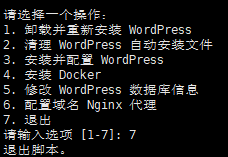

# WordPress Docker 部署脚本 (WordPress Docker Deployment Scripts)

[简体中文](README.zh.md) | [English](README.en.md)

本仓库包含一组脚本，用于通过 Docker 快速搭建、配置和管理 WordPress 环境。这些脚本可以自动化安装和维护 WordPress、MySQL 及相关服务。

This repository contains a collection of shell scripts to set up, configure, and manage a Dockerized WordPress environment. These scripts help automate the installation and maintenance process for WordPress, MySQL, and related services.

## 快速开始 (Quick Start)

运行以下命令，快速下载并运行 `main.sh`：

Run the following command to quickly download and execute `main.sh`:

```bash
git clone https://github.com/anltwayway/wp-wordpress-easy-setup.git
cd wp-wordpress-easy-setup
bash main.sh
```

或者
```bash
curl -fsSL https://github.com/anltwayway/wp-wordpress-easy-setup/archive/refs/heads/main.zip -o wp-setup.zip
unzip wp-setup.zip
cd wp-wordpress-easy-setup-main
bash main.sh

运行main.sh，选择选项1可快速配置wordpress，如果不配置域名，全程无需手动操作，5分钟搞定。
选项1也支持配置域名

## 测试系统和服务器位置（System and Server）

Ubuntu 22.0， Server US;
